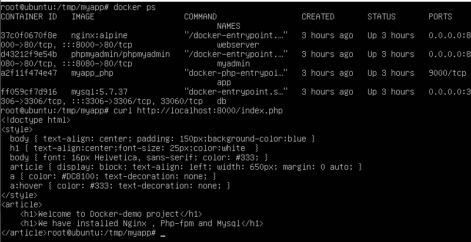
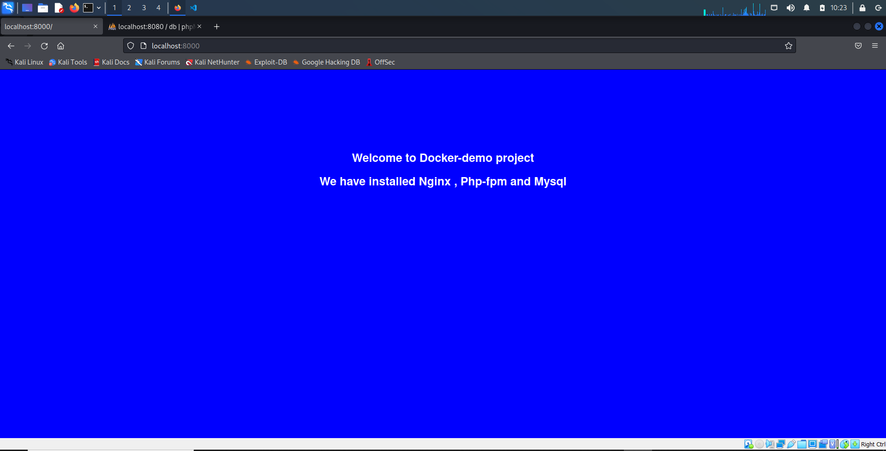
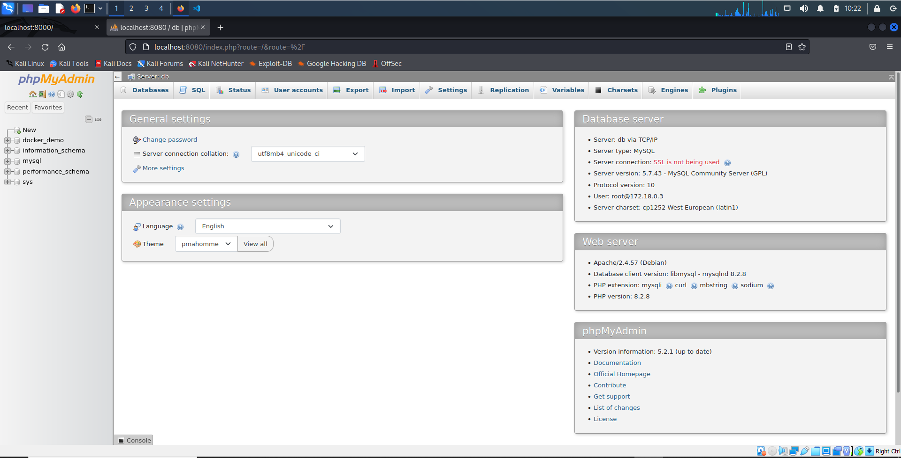

# Setting up Nginx, PHP, MySQL docker containers on remote server with Ansible

## Project Structure

```
├── docker
│   ├── env
│   │   ├── database.env
│   │   └── site.conf
│   ├── nginx
│   │   └── site.conf
│   ├── mysql
│   │   └── site.conf
│   ├── php
│   │   └── Dockerfile
│   ├── webapp
│   │   └── index.php
│   └── docker-compose.yml
│
└── ansible_project
    ├── group_vars
    │   └── web_servers.yml
    ├── ansible.cfg
    ├── roles
    │   ├── app
    │   │   └── tasks
    │   │       └── main.yml
    │   └── setup
    │       ├── handlers
    │       │   └── main.yml
    │       └── tasks
    │           ├── docker.yml
    │           └── main.yml
    ├── hosts.yml
    └── site.yml
```

## Ansible configuration

### 1. Key Generation
```
ssh-keygen -t ed25519 -C "cluster"
ssh-copy-id -i ~/.ssh/cluster.pub root@xxx.xxx.xxx.xxx
```

### 2. Setting up ansible.cfg and hosts.yml files

#### Change directory and Update ansible.cfg
```
cd ansible_project
nano ansible.cfg
```
#### Update ansible.cfg
```ini
# ansible.cfg
[defaults]
inventory = hosts.yml # path-to-your-file
private_key_file = ~/.ssh/cluster # #path-to-your-key
stdout_callback = yaml
stderr_callback = yaml
remote_user = root
```
#### Update hosts.yaml
```
nano hosts.yaml
```
#### Specify your IP-Address
```yaml
# hosts.yml
all:
  children:
    web_servers:
      hosts:
        web1:
          ansible_host: xxx.xxx.xxx.xxx # your IP
```

### 3. Run ansible-playbook
```
ansible-playbook site.yml
```

### Check result


