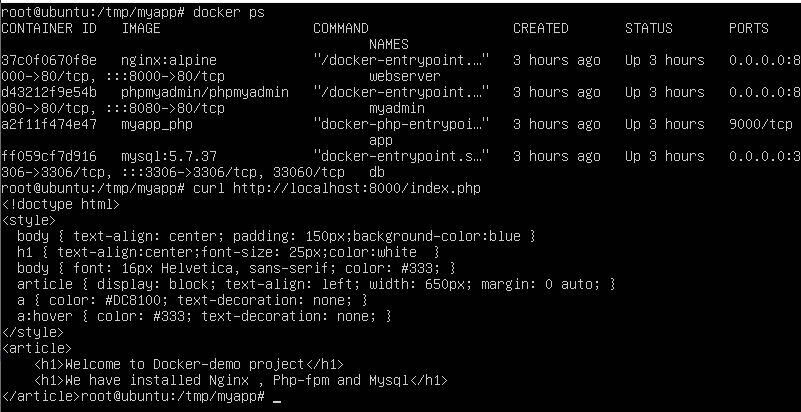
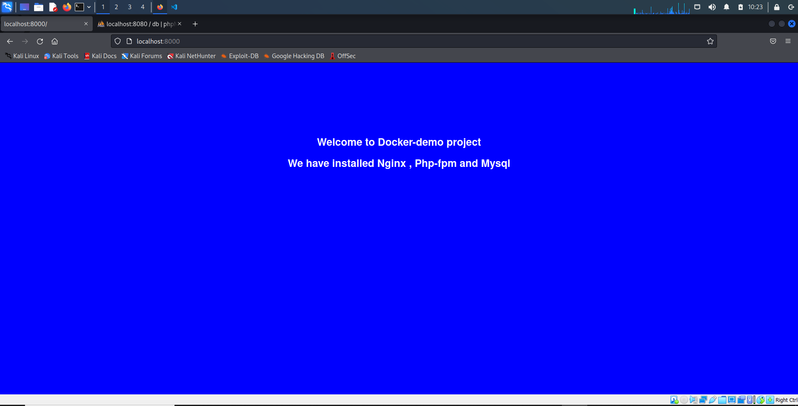
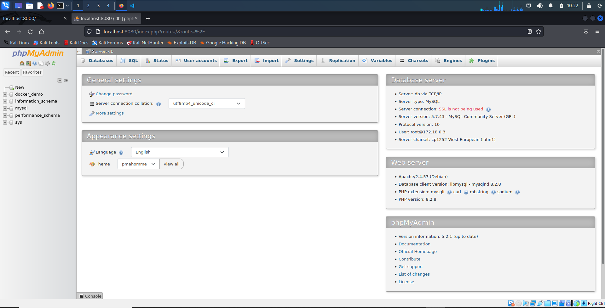

# Setting up Nginx, PHP, MySQL docker containers on remote server with Ansible

## Project Structure

```

└─ ansible_project
  ├── group_vars
  │   └── web_servers.yml
  ├── roles
  │   ├── app
  │   │   ├── files
  │   │   │   └── docker
  │   │   │       ├── nginx
  │   │   │       │    └── site.conf
  │   │   │       ├── mysql
  │   │   │       │    └── sql
  │   │   │       │         └── 10-schema.sql
  │   │   │       │
  │   │   │       ├── php
  │   │   │       │    └── Dockerfile
  │   │   │       └── webapp
  │   │   │            └── index.php
  │   │   ├── tasks
  │   │   │     └── main.yml
  │   │   ├── templates
  │   │   │   ├── docker-compose.yml.j2    
  │   │   │   └── env.yml.j2
  │   │   └── vars
  │   │       └── main.yml
  │   └── setup
  │       ├── handlers
  │       │   └── main.yml
  │       └── tasks
  │           ├── docker.yml
  │           └── main.yml
  ├── hosts.yml
  ├── a_password_file.yml
  ├── ansible.cfg
  └── site.yml
```

## Ansible configuration

### 1. Key Generation
```
ssh-keygen -t ed25519 -C "cluster"
ssh-copy-id -i ~/.ssh/cluster.pub root@xxx.xxx.xxx.xxx
```

### 2. Setting up ansible.cfg and hosts.yml files

#### Change directory and Update ansible.cfg
```
cd ansible_project
nano ansible.cfg
```
#### Update ansible.cfg
```ini
# ansible.cfg
[defaults]
inventory = hosts.yml # path-to-your-file
private_key_file = ~/.ssh/cluster # #path-to-your-key
stdout_callback = yaml
stderr_callback = yaml
remote_user = root
```
#### Update hosts.yaml
```
nano hosts.yaml
```
#### Specify your IP-Address
```yaml
# hosts.yml
all:
  children:
    web_servers:
      hosts:
        web1:
          ansible_host: xxx.xxx.xxx.xxx # your IP
```

#### Update role variable file
```
nano roles/app/vars/main.yml
```

#### Specify your docker-compose setting
```yaml
# main.yml
environment_variables:
  - MYSQL_DATABASE=docker_demo
  - MYSQL_USER={{ mysql_user }}
  - MYSQL_PASSWORD={{ mysql_password }}
  - MYSQL_ROOT_PASSWORD={{ mysql_root_password }}
  - PMA_HOST=mysql
  - PMA_PORT=3306

containers:
  - service_name: mysql
    image: mysql:5.7.37
    container_name: db
    restart: unless-stopped
    ports:
      - "3306:3306"
    volumes:
      - ./mysql/sql/:/docker-entrypoint-initdb.d/
      - dbdata:/var/lib/mysql
    networks:
      - app-network
      * * *
```

### 3. Run ansible-playbook
```
ansible-playbook site.yml --vault-password-file a_password_file
```

### Check result


